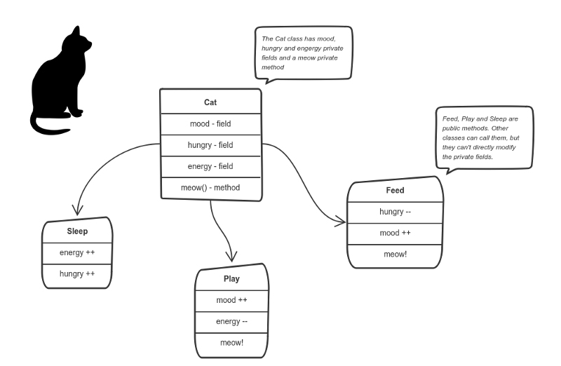
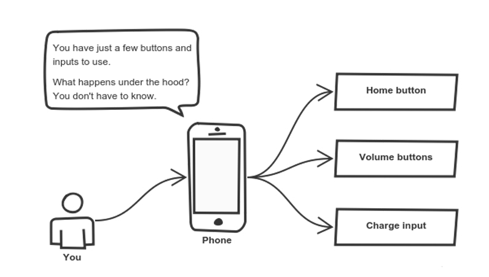
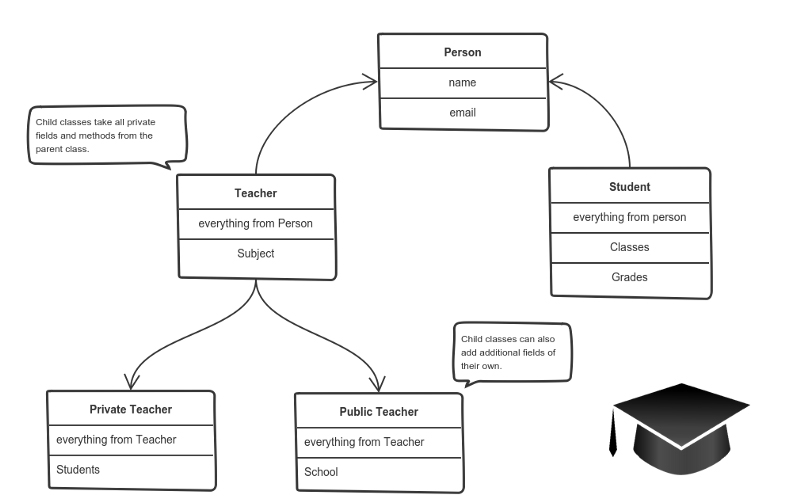

# TYPESCRIPT - SOLID
Learning Challenge

## Must do!
Try to make more time for the theoretical part here. Try to understand, research, document.

- [x] Before installing, read the article: [Typescript for JavaScript programmers](https://www.typescriptlang.org/docs/handbook/typescript-in-5-minutes.html)
- [x] Start with the installation
  - For Mac users that have node.js installed globally:
  - [x] Install Typescript 
    - `npm install typescript --save-dev -g`
  - [x] PhpStorm integration:
  - Here I went for the first option, make it so all TypeScript files are compiled the moment you change something in the file. `File | Settings | Languages & Frameworks | Typescript` and make sure to check -[x] Recompile on changes
  - [x] Install Parcel (make sure you have node.js installed)
    - `npm install parcel --save-dev -g`
    - After installing parcel you should be able to run `parcel index.html` in your project directory.
- [x] Try and make a 'Hello TypeScript'
  - resource: [Hello World](https://www.geeksforgeeks.org/hello-world-in-typescript-language/)

## OOP (Object-Oriented Programming) not an OOPSIE
Let's first go back to OOP and do some reading, research,...

The assertion that everything is an ***object*** is the concept which underlies **Object-Oriented Programming**, OOP for short. The concept of ***objects***
Object-oriented programming is based on the concept of objects. In object-oriented programming data structures, or **objects** are defined, each with its own **properties or attributes.**
Each object can also contain its own **procedures or methods.**

Benefits of using objects:
  - Faster and easier to execute.
  - Providing a clear structure for a program.
  - Making code easier to modify, debug and maintain.
  - Making it easier to reuse code.

### Basic terminology:


- **Object:** These are the real world entities having a specific identity, specific characteristics and behavior you find in your everyday life.
- **Class:** This is the model or standard about the capability of what an object can do. It is the blueprint that represents a set of objects that share common characteristics and behavior.
  - ‘Object’ is an instance of ‘class’. For example, ‘bird’ is a class but ‘eagle’ is an object.
- **Method:** Can modify a class state that would apply across all the instances of the class
- **Instance:** These are like objects, however, let's think about it in these terms: A blueprint for a car design is the class description, all the cars manufactured from that blueprint are objects of that class. Your car that has been made from that blueprint is an instance of that class.


OOP languages are diverse, but the most popular ones are **class-based** languages in which objects are instances of **classes**.

A simple way to explain object-oriented programming is to use something like a car as an example. A car has a model name, a colour, a year in which it was manufactured, an engine size and so on.

We can create a Car object with the properties/attributes name, colour, engine size and year.
For every new car we make we would use the car object. We can have a 2009 blue BMW with an S65 (4.0 Liter Naturally Aspirated V8) engine or a 2017 Red Audi with a 5.0 V10 TFSI engine. In each instance we would reuse the code contained in the original object.

### The 4 Pillars (or main principles) of OOP

### Encapsulation:
Say we have a program. It has a few logically different objects which communicate with each other, according to the rules defined in the program.

Encapsulation is achieved when each object keeps its state **private** inside a class. Other objects **do not** have direct access to this state. Instead, they can only call a list of **public** functions (called methods).

The object manages its own state via methods and no other class can touch it unless explicitly allowed. If you want to communicate with the object, you should use the methods provided. But (by default), you can't change the state.

As an example for encapsulation let's build a tiny Sims game. There are people and there is a cat. They communicate with each other. We want to apply encapsulation, so we encapsulate **all** "cat" logic into a `Cat` class. It may look like this:


You can feed the cat. But you can't directly change how hungry the cat is.

As we can see the "state" of the cat is the private variables `mood`, `hungry` and `energy`. It also has a private method `meow()`. It can call it whenever it wants, the other classes can't tell the cat when to meow.

What they can do is defined in the **public methods** `sleep()`, `play()` and `feed()`. Each of them modifies the internal state somehow and may invoke `meow()`. Thus, the binding between the private state and public methods is made.

This is what **encapsulation** does.

### Abstraction:
Abstraction can be thought of as a natural extension of encapsulation.

In object-oriented design, programs are often extremely large. And separate objects communicate with each other a lot. So maintaining a large codebase, with changes along the way, is difficult.

**Abstraction** is a concept aiming to ease this problem.

Applying abstraction means that each object should only expose a high-level mechanism for using it.

This mechanism should hide internal implementation details. It should only reveal operations relevant for the other objects.

A real-life example of abstraction? Think about how you use your phone:



You interact with your phone by using only a few buttons. What's going on under the hood? You don't have to know, implementation details are hidden. You only need to know a short set of actions.

Implementation changes, for example a software update, rarely affect the abstraction you use.

### Inheritance:
OK, encapsulation and abstraction can help us develop and maintain a big codebase. But what is another problem in OOP design?

That objects are often very similar. They share common logic, but they are not **entirely** the same.

So here arises the question: How do we reuse the common logic and extract the unique logic into a separate class? One way to achieve this is **inheritance**.

Inheritance is the ability of one object to acquire some/all properties of another object. For example, a child inherits the traits of his/her parents.
With inheritance, reusability is a major advantage. The child class reuses the fields and methods of the parent class and can implement its own.


*A private teacher is a type of teacher. And any teacher is a type of person.*

If you have a program that needs to manage public and private teachers, but also other types of people like students, we can implement the above class hierarchy.
In this way, each class adds only what is necessary for it while reusing common logic with the parent classes.

### Polymorphism
The most complex word! Polymorphism, in Greek it stands for ***many shapes***.

When you think of polymorphism you should think about adaptation, changing behaviour depending on the data it's given.
Let's use the + sign for example. In JavaScript the + sign polymorphs depending on what data we give it. 
For example:
  - It can add up 2 numbers, `20 + 20 = 40`
  - We can also give it 2 strings `"Hello" + "World"` that will concatenate to `"Hello World"`
  - Or we can have a string and a number `"Hello " + "44"` which will give us `"Hello 44"`

This is polymorphism, it changes its behaviour depending on what circumstances we throw at it.

So it is the process of using an operator or function in different ways for different data input. In practical terms, polymorphism means that if class B inherits from class A, it doesn't have to inherit everything about class A.
It can do some things that class A does differently.

Let's look at a php example:
```php
  
    abstract class Shape {
        private $x = 0;
        private $y = 0;
    
        public abstract function area();
    }

    class Rectangle extends Shape {
        function __construct($x, $y){
            $this->x = $x;
            $this->y = $y;
        }
        function area(){
            return $this->x * $this->y;
        }
    }

    class Square extends Shape {
        function __construct($x){
            $this->x = $x;
        }
        
        function area() {
            return $this->x * $this->x;
        }
    }

    $shapes = [ new Square(6), new Rectangle(10, 5), new Square(9) ];
```

## SOLID

SOLID ᕦ(ò_ó)ᕤ a set of 5 principles, helping you write good OOP code. It is considered as one of the leading theories for modern code.

### **S** - Single Responsibility Principle

The ***Single Responsibility Principle*** states that **a Class should do one thing, therefore it should have only a single reason to change.**


If a Class has many responsibilities it increases the possibility of bugs because making changes to one of its responsibilities. It could affect the other ones without knowing.

#### To Do:
- [x] Refactor the code from old.ts
- What we need:
  - [x] Car class
  - [x] Engine class
  - [x] MusicPlayer class
  - [x] Also added a fuel tank
  - [x] The fuel functionality should go... I created a new method that consumes fuel and put the addfuel method in a class named fuelTank.
- Extra challenge:
  - [ ] Make a new type of Engine that also consumes Fuel

#### Goal:
This principle aims to separate behaviours so that if bugs arise as a result of your change it won't affect other unrelated behaviours.

### **O** - Open-Closed Principle

The ***Open-Closed Principle*** requires that **Classes should be open for extension and closed for modification.**
In doing so, we stop ourselves from modifying existing code and causing potential new bugs in an otherwise ***happy*** application.


**Modification** means changing the code of an existing Class and **extension** means adding new functionality.

Let's explore the concept with a quick code example. Imagine we have implemented a Guitar class. 🎸 It's fully fledged and even has a volume knob:

```typescript
    class Guitar {
        private _model : string;
        private _volume : number;
        
        //constructors, getters, setters
    }
```

We launch the app and everyone loves it! But after a few months we decide the guitar is a little boring and it could use a cool flame pattern to make it look more rock and roll.
At this point, it might be tempting to just open the Guitar class and add a flame pattern. But who knows what errors that might throw up in our application.

Instead whe should **stick to the open-closed principle and simply extend our Guitar class:**

```typescript
    class SuperCoolGuitarWithFlames extends Guitar {
        private _flameColor : string;
        
        //constructor, getters, setters
    }
```

By **extending** the Guitar class we can be sure that our existing app won't be affected.

#### Goal:
This principle aims to extend a Class's behaviour without changing the existing behaviour of that Class.
This is to avoid causing bugs wherever the Class is being used.

#### To Do:
- [x] Refactor the code from old.ts
- What we need:
  - [x] Add an animal
  - [x] Make sure it makes a sound
  - [x] Create a `makeSound` function to each Animal class
  - [x] Remove the giant switch from the Zoo class

### **L** - Liskov Substitution Principle

The ***Liskov Substitution Principle*** states that subclasses should be substitutable for their base classes.

This means that, given Class B is a subclass of Class A, we should be able to pass an object of Class B to any method that expects an object of Class A and the method should not give any weird output in that case.


When we use **inheritance** we assume that the child class inherits everything that the superclass has. The child class extends the behaviour but **never** narrows it down.

Let's jump to some code to help us understand this concept:

```typescript
    class Rectangle {
        constructor(private _width: number, private _height: number) {}

        public area() : number {
            return this._height * this._width;
        }
    }
    
    class Square extends Rectangle {}
```
This is a classic example that is a violation of this principle, the [Rectangle-Square problem](http://www.blackwasp.co.uk/SquareRectangle.aspx).
The `Square` class extends the `Rectangle` class and assumes that the width and height are equal. When calculating the area of a square, we would get the wrong value.

We can solve this in the following way:

```typescript
    interface Shape {
        area(): number;
    }

    class Rectangle implements Shape {
        constructor(private _width: number, private _height: number) {}

        public area(): number {
            return this._height * this._width;
        }
    }

    class Square implements Shape {
        constructor(private _height:number) {}
  
        public area(): number {
            return Math.pow(this._height, 2);
        }
    }
```
By implementing a `Shape` interface that will have to be implemented by every new shape we add. We can then use the area() method and make it return the right calculations for each new shape.

#### Goal:
This principle aims to enforce consistency so that the parent Class or its child Class can be used in the same way without any errors.

#### To Do:
- [x] Refactor the Discount Class from old.ts, made an interface from Discount
- What we need:
  - [x] An Interface
  - [x] VariableDiscount class
  - [x] FixedDiscount class
  - [x] NoDiscount class

### **I** - Interface Segregation Principle

**Segregation** means keeping things separated and the ***Interface Segregation Principle*** is about separating the interfaces.


The principle states that many client-specific interfaces are better than one general-purpose interface. Clients should not be forced to implement a function they do not need.

I found this fun example with a zookeeper, to be more specific, he'll be working in the bear enclosure.
So we start with an interface that outlines the roles of a bear keeper:

```typescript
    interface BearKeeper {
        washTheBear():void;
        feedTheBear():void;
        petTheBear():void;
    }
```
As zookeepers, we're more than happy to wash and feed our beloved bear. Because we're all too aware of the dangers of petting them.
Unfortunately, our interface is rather large, and we have no choice but to implement the code to pet the bear.
Let's fix this by **splitting** our large interface into three separate ones:

```typescript
    interface BearCleaner {
        washTheBear():void;
    }
    
    interface BearFeeder {
        feedTheBear():void;
    }
    
    interface BearPetter {
        petTheBear():void;
    }
```
Thanks to interface segregation, we're free to implement only the methods that matter to us:

```typescript
    class BearCarer implements BearCleaner, BearFeeder {
        washTheBear():void {
            //I think we missed a spot...
        }
        
        feedTheBear():void {
            //Tuna Tuesdays...
        }
    }
```
And finally, we can leave the dangerous stuff to the reckless people:

```typescript
    class CrazyPerson implements BearPetter {
        public petTheBear():void {
            //Good luck with that!
        }
    }
```

#### Goal:
This principle aims at splitting a set of actions into smaller sets so that a Class executes **ONLY** the set of actions it requires.

#### To Do:
- [x] Refactor old.ts
- [x] Look at the 2 different users
  - User
  - Admin
- [x] Each authentication method should have its own interface
  - [x] password
  - [x] google
  - [x] facebook
- Extra difficulty
  - [x] Make a Google bot class
  - [x] Can only use the Google option to log in

- Step 2 (optional):
  - Google and Facebook code is almost identical
  - [ ] Refactor this code to small, separate dependencies

### **D** - Dependency Inversion Principle

The ***Dependency Inversion Principle*** states that our classes should depend upon interfaces or abstract classes instead of concrete classes and functions.


An example:

```typescript
    class MemoryStorage {
        private _storage: any[];

        constructor() {
            this._storage = [];
        }
        
        public insert(record:any):void {
            this._storage.push(record);
        }
    }
    
    class PostService {
        private _db = new MemoryStorage();
        
        public createPost(title:string) {
            this._db.insert(title);
        }
    }
```
Here, the PostService class depends on the `MemoryStorage` class to save new posts. What happens if we need to change the storage used to save posts?
We'll have to modify the `PostService` class to change the type of the `_db` property, thus violating the **Open-Closed Principle**.

If `PostService` relies on an interface instead of a class, we wouldn't have to make changes on it.

```typescript
    interface DatabaseStorage {
  insert(record: any): void;
}

class MemoryStorage implements DatabaseStorage {
  private _storage: any[];

  constructor() {
    this._storage = [];
  }

  public insert(record: any): void {
    this._storage.push(record);
  }
}

class PostService {
  private _db: DatabaseStorage;

  constructor(db: DatabaseStorage) {
      this._db = db;
  }

  public createPost(title: string) {
    this._db.insert(title);
  }
}
```

- High-level modules should not depend on low-level modules. Both should depend on the abstraction.
- Abtstractions should not depend on details. Details should depend on abstractions.

**High-level Module (or Class):** Class that executes an action with a tool.
**Low-level Module (or Class):** The tool that is needed to execute the action.
**Abstraction:** Represents an interface that connects the two Classes.
**Details:** How the tool works.

The Dependency Inversion principle says a Class should not be fused with the tool it uses to execute an action.
Rather, it should be fused to the interface that will allow the tool to connect to the Class.

#### Goal:
This principle aims at reducing the dependency of a high-level Class on the low-level Class by introducing an interface.

#### To Do:


The SOLID principles represent the cornerstone of ***state-of-the-art*** software. When combined, they make it easier for programmers to develop code that's easier to understand, extend and maintain.


## Resources:

[The Four Pillars of Object  Oriented Programming](https://info.keylimeinteractive.com/the-four-pillars-of-object-oriented-programming)
[Object-Oriented Programming for Kids](https://funtech.co.uk/latest/explain-object-oriented-programming-to-kids#:~:text=The%20simplest%20way%20to%20explain,size%20and%20year%20as%20attributes.)
[How to explain object-oriented programming concepts to a 6-year-old](https://www.freecodecamp.org/news/object-oriented-programming-concepts-21bb035f7260/)
[The SOLID Principles of Object-Oriented Programming Explained in Plain English](https://www.freecodecamp.org/news/solid-principles-explained-in-plain-english/)
[SOLID principles using Typescript](https://medium.com/@alejandromarr/solid-principles-using-typescript-c475031efcd3)
[The S.O.L.I.D Principles in Pictures](https://medium.com/backticks-tildes/the-s-o-l-i-d-principles-in-pictures-b34ce2f1e898)
[A Solid Guide to SOLID principles](https://www.baeldung.com/solid-principles)
